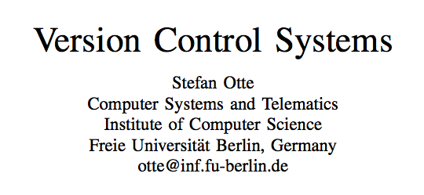
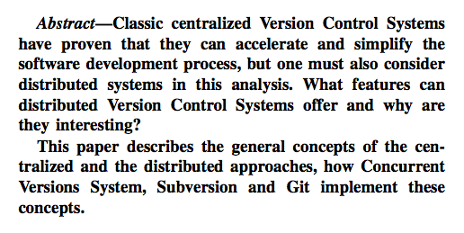
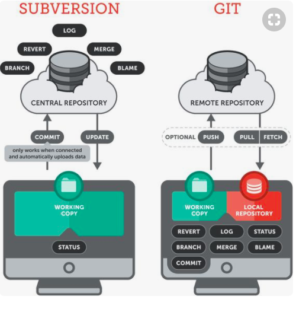
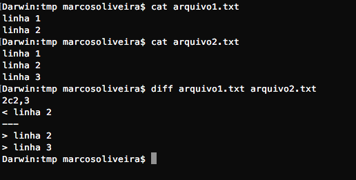
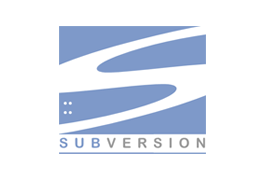
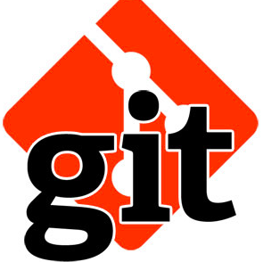
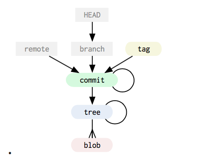
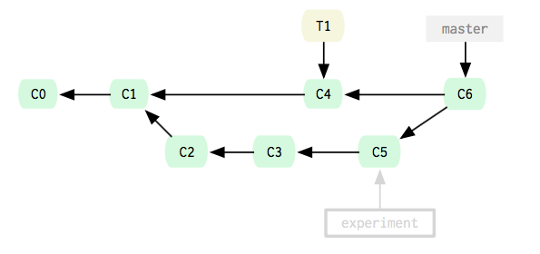
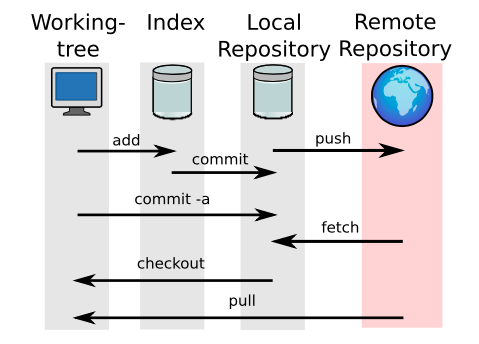

# Controle de Versão

##

##

## Introdução
* VCS -  Version Control System
    + Acelera e simplifica o processo de desenvolvimento
    * Monitora alterações em arquivos
        * Source e outros
    * Histórico das alteralções
    * Acesso concorrente
    * CVCS / DVCS

## Conceitos Básicos
* Diferentes Termos / Mesmo significado
    * Revision Control System (RCS)
    * Source Code Managment (SCM)
    * Software Configurtion Management
    * Source Code Control
    * Version Control System (VCS)

## Conceitos Básicos (Continuação)
* Contralized Version Control System (CVCS)
    * Repositório Centralizado - servidor onde todos arquivos e metadados estão armazenados
    * Acesso via LAN/WAN
    * Revisão / Versão - Fotografia (snapshot) do projeto em dado momento (tipicamente representada por um número sequencial)
    * Checkout - baixa os arquivos de uma determinada versão
    * Working Copy ou Working Directory ou Diretório de Trabalho - cópia local dos arquivos
    * Commit , Commit mensagem - gravar versão no repositório com sua mensagem
    * Diff, Delta - Diferença entre arquivos e versões diferentes de um mesmo arquivo
    * Mainline ou Trunk - linha do tempo principal de um projeto
    * Branch - linha do tempo alternativa
    * Tag -  um apelido para um revisão ou versão

## Conceitos Básicos (Continuação)
* Distribuition Version Control System (DVCS)
    * **Não é obrigatório** ter um servidor centralizado para o repositório
    * Repositório local
    * Trabalho *offline*
    * Rapidez nas operações
    * Mesmo conceito que no CVCS
        * commit, branchs, tags, checkouts
    * Outras operações
        * fetch, push, pull

## CVCS x DVCS

## Conceitos Básicos (Continuação)
* Merge
    * Estratégias para lidar com a concorrência:
        * Lock-modify-unlock - estratégia pessimista
	* Lock-modify-merge - estratégia otimista
	    * usada pelo CVS
* Diff / Delta

## Programas
* CVS - Concurrente Control Version (Centralizado)
* SVN - Subversion (Centralizado)
* GIT (Distribuído)

## 

## CVS
* Criado por Dick Grune 1984
* Reescrito em C Brian Berlinner 1989
* Baseado no RCS (manipula arquivo de texto)
* Usado pelo souceforge.net
    * 100.000 pejetos FOSS - Free and Open Souce Sofware

## Limitações CVS
* Não tralbalha com arquivos binários
* Commit por arquivo
* TAG é uma operação custosa
* Ao mover e renomear arquivos se perde os histórico

## SVN
* Proposta - ser um CVS melhorado
* Primeira versão publicada em 2001 pela CollabNet - usando o próprio SVN

## Diferenças entre SVN e CVS
* Não usa RCS, usa Berkeley DB ou FSFS[^1]
* Atomic Commits
* Renomear e mover arquivos não perde os histórico
* Suporta arquivo binários
* Tags e branch são operações menos custosas
* Algumas operações *offine*
* Resolução interatica de conflitos, checkout parciais, etc.

[^1]: FSFS - Fast Secure File System

## Projeto
* Modulos
    * Client Layer
        * libsvn_client, libsvn_wc
    * Repository Access Layer
        * libsvn_ra, libsvn_local, libsrv_dav (WebDAV)[^2]
    * Repository Layer
        * libsvn_repos, libsvn_data, libsvn_fs

[^2]: WebDAV - **Web**-based **D**istributed **A**uthoring and **V**ersioning

##

## Git
* Criado 2006 - Linus Torvalds - Kernel Linux
* Substituir BitKeeper
* Requisitos:
    * Confiável, Boa performance, distribuído, não ser igual ao CVS

## Caracteristicas do Git
* Não usa a diferença para armazenar os arquivos
* Monitora o conteudo do arquivo
* Importa repositórios CVS e SVN
* Poucos comandos são necessários para trabalhar com o Git
    * *git init, git clone, git add, git commit, git push e git pull*
* comandos *pumbling e porcelain*

## Modelo de objetos do Git
* Blob - arquivos que estão sendo monitorados
* Tree - pastas e subpastas
* Commit - snapshot do projeto no tempo
* Tag - um apelido para o commit

## 

## SHA1
* Função Hash criptográfica
* Para comitorar o conteúdo o Git armazena o conteúdo e hash dos objetos
* Dois objetos com mesmo hash são o mesmo objeto
* Permite testar a integridade dos objetos
* Não usa número para revisão/versão e sim SHA1

## Merging
* Merge e Branch são conceitos chaves no Git

## Estrutura do repositório
* Working Tree - pasta onde estão os arquivos é o diretorio de trabalho
* Repositório local - fica na pasta oculta **.git**
* Index ou Staging area
* Repositório remoto:
    * Ex.: Github

##

## Conclusão
### SVN e CVS
* Acelera o processo de desenvolvimento de software
* Conceitos simples e fácil aplicação
* Limitações
    * Inabilidade de trablaho *offline*
    * fraca capacidade de trabalho com branch e merge

### Git
* Trabalho *offline*
* Maior liberdade
* Domina o mercado

